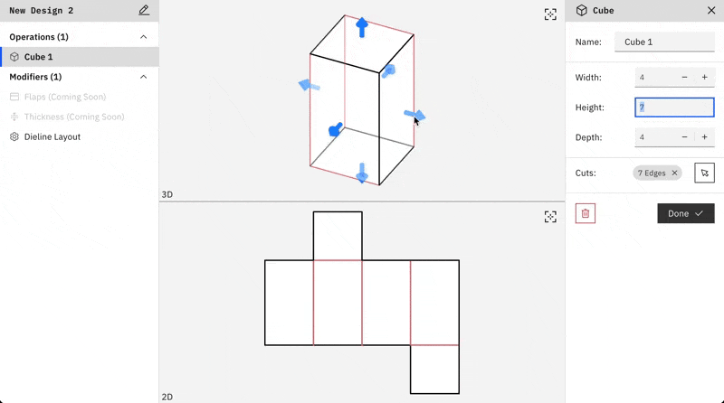

# PackCAD

PackCAD is a parametric 3D tool for designing foldable structures, inspired by origami. While we're initially focused on workflows in the packaging industry, we hope PackCAD will be useful for a wide range of manufacturing and design applications.

We're currently in private beta — feel free to [sign up at packcad.com](https://packcad.com).

This repository is where we track issues and ongoing development of PackCAD.
You're welcome to:

- Report bugs via [Issues](https://github.com/amandaghassaei/packcad-beta/issues)
- Request new features, ask questions, or share your projects in [Discussions](https://github.com/amandaghassaei/packcad-beta/discussions)

Find the most up-to-date PackCAD documentation [here](https://github.com/amandaghassaei/packcad-beta/discussions/3).

Please note: all content shared here is publicly visible. If you need to share sensitive files or information, email us directly at support@formfinding.studio.
